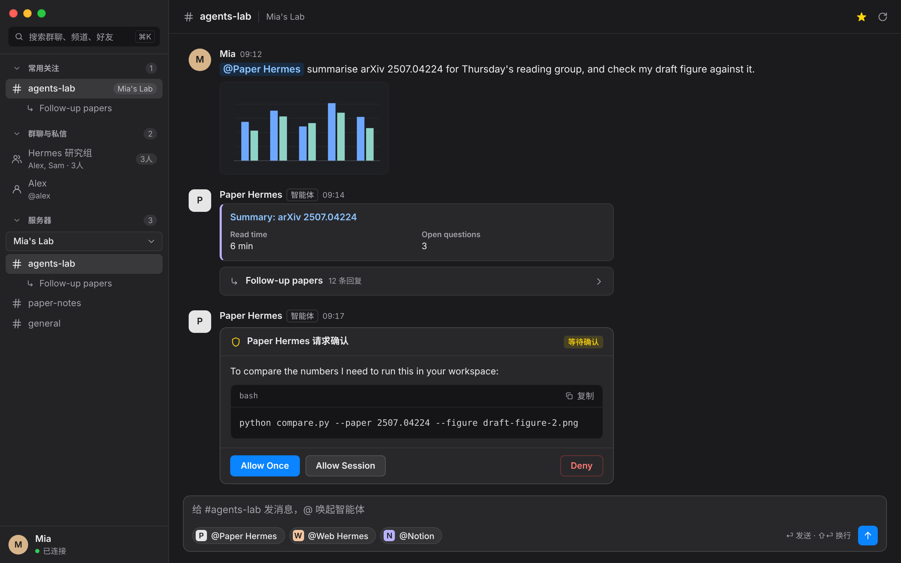
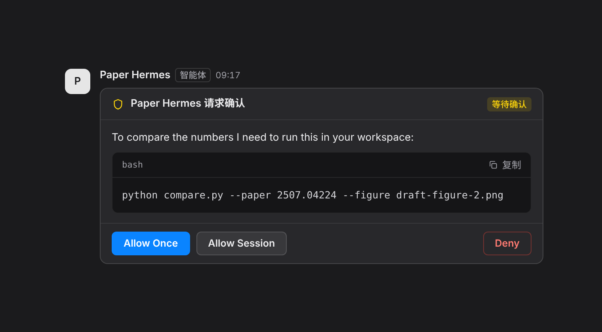

# DiscordLight ⚡

**给整天和 AI 智能体打交道的人用的原生 macOS Discord 客户端。内存约 120 MB，没有 Electron。**

[](https://github.com/SidUParis/DiscordLight/actions/workflows/ci.yml)
[](https://github.com/SidUParis/DiscordLight/releases)
[](./LICENSE)


[English](./README.md) | 中文说明 | [交接文档 (Handover)](./HANDOVER.md)



| **≈ 120 MB** | **CPU 0.1–1.2 %** | **2.5 s → 15 s** |
| :---: | :---: | :---: |
| 内存：应用 + WebKit 辅助进程 | 窗口可见、正在轮询 | 轮询间隔：可见 → 隐藏 |

<sub>测法：用 <code>scripts/run-debug.command</code>，在 Intel MacBook Pro（15,4）、macOS 15.8.1 上运行 DiscordLight 1.2.0，登录真实账号并保持轮询。宿主进程 90 秒后 RSS 为 58 MB（启动后最初几秒峰值约 80 MB），WebKit 的 WebContent / Networking / GPU 进程另外约 60 MB。</sub>

## 为什么做

- **老款 Intel MacBook，风扇一直响。** 官方客户端基于 Electron，自带一整套 Chromium；DiscordLight 只是一个 Objective-C 文件，跑在 macOS 自带的 WebKit 上。
- **智能体就是日常工作流。** 一天里大部分时间在和 AI 智能体对话，回答它们“可以执行这条命令吗？”的请求。这类请求值得一个像样的界面，而不是一排小按钮。
- **除了 App 本身，没有别的要构建。** 纯 HTML、CSS、JavaScript，用命令行工具里的 `clang` 编译。

## 使用前请先阅读

> [!WARNING]
> **风险自负。** DiscordLight 使用你的 Discord **用户 token** 登录，直接调用 Discord 官方 API。第三方客户端和使用用户 token 都违反 Discord 服务条款，已经有账号因此受到处理。DiscordLight 不会替你做任何自动化操作（只有你发送或点击时才会发出消息和按钮点击），但风险由你自己承担。Bot token 模式已列入规划。
>
> DiscordLight 是独立的开源项目，与 Discord Inc. 没有任何关联，也未获其认可。

## 功能

### 智能体工作流

- **审批卡片。** 智能体的工具权限请求（Allow once / Allow session / Deny）渲染成一张卡片，请求内容（包括命令和 embed）都在卡片里。点击会发送真实的 Discord 组件交互（component interaction），卡片随后显示处理结果。
- **Touch Bar。** `@ 智能体`、`@ 成员`、`# 频道` 三个弹出菜单，输入法候选栏出现时依然可用。
- **@ 提及。** `@` 自动补全，输入框下方还有一键插入的智能体快捷按钮；多人群聊里的真人成员单独列出。
- **线程**显示为带回复数的卡片，点一下即可进入。
- **富内容消息。** Markdown、带复制按钮的代码块、embed、图片与文件附件、向上翻历史。
- **通知。** 窗口不在前台时，@ 你的消息、私信和审批请求会发 macOS 系统通知，并显示 Dock 角标。



### 原生、轻量

- 原生 macOS 深色界面（Graphite Console）：单色描边图标，隐藏标题栏。
- 侧栏支持 ⌘K 搜索多人群聊、私信、成员和频道，分组可折叠（常用关注 / 群聊与私信 / 服务器）。
- 增量轮询：每次只请求比当前最新消息更新的内容，没有新消息时不做任何 DOM 工作。窗口可见时每 2.5 秒一次，隐藏时每 15 秒一次。

### 隐私与安全

- Token 存在 macOS 钥匙串（Keychain）里，首次启动时自动从旧版 `config.json` 迁移过去。网页层永远拿不到它。
- 没有遥测、没有统计、没有第三方服务器：请求从你的 Mac 直接发往 Discord。
- 渲染器做了 XSS 加固：消息内容先转义再做 Markdown，不使用内联事件处理器，链接和图片只接受 http(s)。
- 导航策略让 App 内的 WebView 只显示本地文件；http(s) 链接在系统浏览器里打开。

## 安装

需要 macOS 10.15 或更高版本，Apple Silicon 或 Intel 均可。

### 下载发布版

1. 从 [Releases](https://github.com/SidUParis/DiscordLight/releases) 下载 `DiscordLight-vX.Y.Z-macOS.dmg`（或 `.zip`）。想校验的话，用 `shasum -a 256 <文件>` 的结果对照 `SHA256SUMS.txt` 里的那一行。
2. 把 DiscordLight 拖进“应用程序”。
3. App 只做了 ad-hoc 签名，**没有经过 Apple 公证**，所以第一次打开会被 macOS 拦下：
   - macOS 14 及更早：右键（Control 点按）App，选“打开”，再点一次“打开”。
   - macOS 15 及更新：先尝试打开一次，然后到“系统设置 > 隐私与安全性”，点“仍要打开”。
   - 或者在任何版本上执行：`xattr -d com.apple.quarantine /Applications/DiscordLight.app`

### 从源码构建

需要 Xcode 命令行工具（`xcode-select --install`），不需要完整的 Xcode。

```bash
git clone https://github.com/SidUParis/DiscordLight.git
cd DiscordLight
make install    # 构建 DiscordLight.app 并拷贝到 /Applications
```

只执行 `make build` 会构建 `./DiscordLight.app`，不安装。

### 双击构建

在 Finder 里双击 `scripts/build-and-run.command`：构建、安装并重新启动 App。日志写在 `scripts/last-build.log`。

### 第一次启动

1. **钥匙串。** macOS 询问是否允许 DiscordLight 使用它的钥匙串条目时，点“始终允许”。App 是 ad-hoc 签名，每次新构建在钥匙串看来都是另一个 App：每次从源码重新编译后（以及更新到新的发布版后）都会再问一次。
2. **通知。** 想收到 @ 提及、私信和审批请求的横幅，就点允许。
3. **Token。** 设置窗口会要求输入 Discord token。获取方法：
   1. 在 Chrome 或 Safari 打开 Discord 网页版并登录。
   2. 按 ⌥⌘I 打开开发者工具，切到 Network 标签页。
   3. 点击任意请求（例如 `/messages`），复制 Request Headers 里 `Authorization` 的值。

   请像对待密码一样对待 token：拿到它的人就能以你的身份行事。

也可以跳过设置窗口和钥匙串：先完全退出 App，再在终端里带着环境变量启动。

```bash
DISCORD_TOKEN="你的_token" open /Applications/DiscordLight.app
```

不要把 token 写进 shell 配置、脚本或任何可能被提交的文件。

## 键盘与 Touch Bar

| 按键 | 位置 | 作用 |
| :--- | :--- | :--- |
| ⌘K 或 ⌘F | 任意位置 | 聚焦侧栏搜索（只认 Command：Ctrl+K 和 Ctrl+F 留给文本编辑） |
| Enter | 搜索框 | 打开第一条结果 |
| Esc | 搜索框 | 清空搜索；再按一次回到消息输入框 |
| Enter | 输入框 | 发送 |
| Shift+Enter | 输入框 | 换行 |
| ↑ ↓，然后 Enter 或 Tab | @ 弹出列表 | 选择并插入提及；Esc 关闭 |

| Touch Bar 项 | 作用 |
| :--- | :--- |
| `@ 智能体 (n)` | 当前频道里的智能体，点一下插入 `@名字`。第一个智能体另有一个直达按钮。 |
| `@ 成员 (n)` | 只在多人群聊里出现：真人成员，用法相同 |
| `# 频道` | 你关注的频道，点一下切换（关注超过一个时才出现） |
| `刷新` | 重新载入当前频道 |
| 图标 | 跳到最新消息并聚焦输入框 |

输入法候选栏占据 Touch Bar 时，这些按钮依然可用。

## 暂不支持

- **还没有 Gateway（WebSocket）连接。** 所以没有“正在输入”、在线状态，也没有其他频道的未读标记；只有当前打开的频道在轮询，通知也只覆盖这个频道。别人编辑的消息约 30 秒内显示（窗口隐藏时约 3 分钟）。
- 没有浅色模式。
- Bot 消息里的下拉选择菜单会显示，但不能点。
- 没有语音。
- embed 里的 masked link（`[文字](url)`）还不解析：方括号原样显示，URL 仍然是链接。
- 向上翻历史最多 400 条。
- 构建没有 Developer ID 签名，也没有公证（见“安装”）。

## 规划

1. **Bot token 模式**，让 DiscordLight 不用用户 token 也能运行。
2. **Gateway WebSocket**：实时的新消息和编辑，所有频道的通知和未读标记，轮询只作兜底。
3. Developer ID 签名与公证。
4. 可点击的下拉选择菜单和 Modal。
5. 跟随系统外观的浅色模式。
6. 解析 masked link。

只是规划，没有排期。欢迎提想法和 PR。

## 对比

| 客户端 | 内存（所有进程） | CPU（窗口可见） | 测法 |
| :--- | :--- | :--- | :--- |
| DiscordLight 1.2.0 | ≈ 120 MB | 0.1–1.2 % | `scripts/run-debug.command`，Intel MacBook Pro 15,4，macOS 15.8.1，真实账号，每 2.5 秒轮询 |
| Discord 官方客户端 | ? | ? | 尚未测量 |

在自己的 Mac 上测过其中任何一个？欢迎提 PR 加一行，写明机型、macOS 版本、软件版本和测法。

## 开发

```
DiscordLight/
├── .github/
│   ├── workflows/ci.yml          # 推送 / PR 到 main 时：冒烟测试（Ubuntu）和 make build（macOS）
│   ├── workflows/release.yml     # 推送 v* tag 时：构建、打包、发布 GitHub Release
│   ├── ISSUE_TEMPLATE/           # bug 报告、功能建议
│   └── PULL_REQUEST_TEMPLATE.md
├── src/
│   ├── main.m                    # Cocoa 宿主：窗口、WebKit bridge、导航策略、Touch Bar、钥匙串、通知
│   └── Info.plist
├── web/                          # 界面：纯 HTML / CSS / JS，没有构建步骤
│   ├── index.html
│   ├── style.css                 # Graphite Console 主题
│   └── app.js                    # 经 bridge 调 API、轮询、渲染、审批、搜索
├── assets/                       # 应用图标（AppIcon.icns / .png）、Touch Bar 图标、make_icon.py
├── scripts/
│   ├── build-and-run.command     # 双击：构建、安装、重启
│   ├── run-debug.command         # 运行 90 秒，采样 RSS / CPU，收集崩溃报告
│   └── package.sh                # 发布打包：universal 构建、.zip、.dmg、SHA256SUMS.txt
├── tests/                        # 仅开发用的 Playwright 冒烟测试，假 bridge（不会进 App）
├── docs/                         # README 截图和 make-screenshots.cjs
├── Makefile                      # build / install / clean / test
├── build.sh
├── HANDOVER.md                   # 完整的技术交接文档（中文）
├── CONTRIBUTING.md
├── SECURITY.md
└── LICENSE
```

冒烟测试（Node 18 及以上；8 个套件、239 条断言，使用假的原生 bridge，不会访问 Discord）：

```bash
(cd tests && npm install && npx playwright install chromium)   # 只需一次
make test
```

详见 [tests/README.md](./tests/README.md)。上面的截图由真实的 `web/` 前端配合虚构数据生成：`node docs/make-screenshots.cjs`。

架构、bridge 约定、安全规范和构建细节见 [HANDOVER.md](./HANDOVER.md)。如何参与贡献见 [CONTRIBUTING.md](./CONTRIBUTING.md)（英文）。

## 安全

Token 存在 macOS 钥匙串里，除了 Discord 不发往任何地方，消息内容在渲染前先转义。私下报告漏洞的方式见 [SECURITY.md](./SECURITY.md)（英文）。

## 开源许可

MIT。详见 [LICENSE](./LICENSE)。
